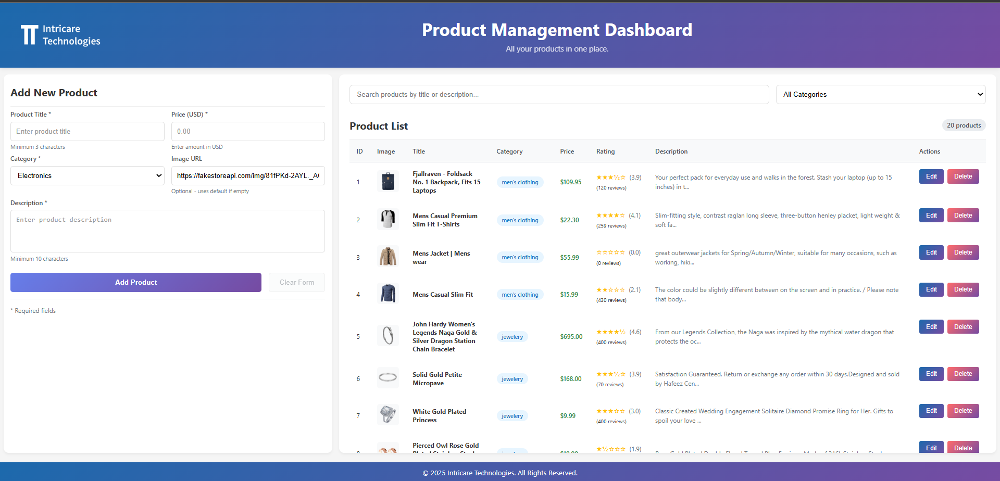

Here’s a **short and simple README** based on your project requirements:

---

# 🛒 Product Management Dashboard

A mini React.js dashboard for managing products using the FakeStoreAPI.
Users can **view, add, edit, delete, search, and filter** products.

## 🚀 Features

* **View Products:** Fetch and display products from `https://fakestoreapi.com/products`
* **Add Product:** Mock POST request to add a new product
* **Edit Product:** Update product details using a mock PUT request
* **Delete Product:** Remove a product using DELETE
* **Search & Filter:** Client-side search + optional category filtering

## 🛠 Tech Used

* React.js (Functional Components + Hooks)
* Axios or Fetch API
* FakeStoreAPI (mock backend)

## ▶️ Run the Project

```bash
npm install
npm run dev
```

